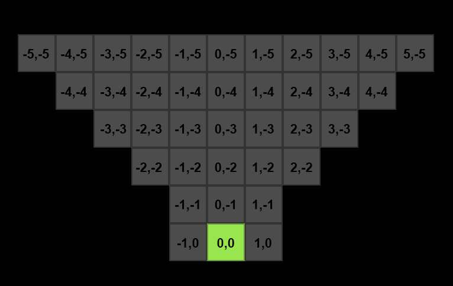
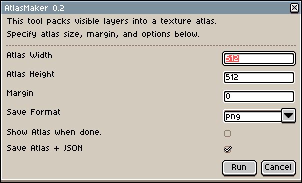

# AtlasMaker extension for Aseprite
 Exports layers to a packed atlas

## Extension:
[Latest AtlasMaker extension for Aseprite](https://github.com/zooperdan/AtlasMaker-extension-for-Aseprite/raw/refs/heads/main/files/atlasmaker_for_aseprite_0.2.zip)

## How to use
- Download and install the extension.
- Download [dungeon.aseprite](https://github.com/zooperdan/AtlasMaker-extension-for-Aseprite/raw/refs/heads/main/files/dungeon.aseprite) example and open it in Aseprite.
- In Aseprite go to the "Sprite" menu and click on "AtlasMaker".
- A dungeon.png and a dungeon.json will be generated next to the dungeon.aseprite file.
- Read the dungeon.png and dungeon.json into your code, parse it and draw dungeon on screen!

## Layer explanation

- Green tile is player position.
- Gray tiles are what player can see.

## Screenshots

